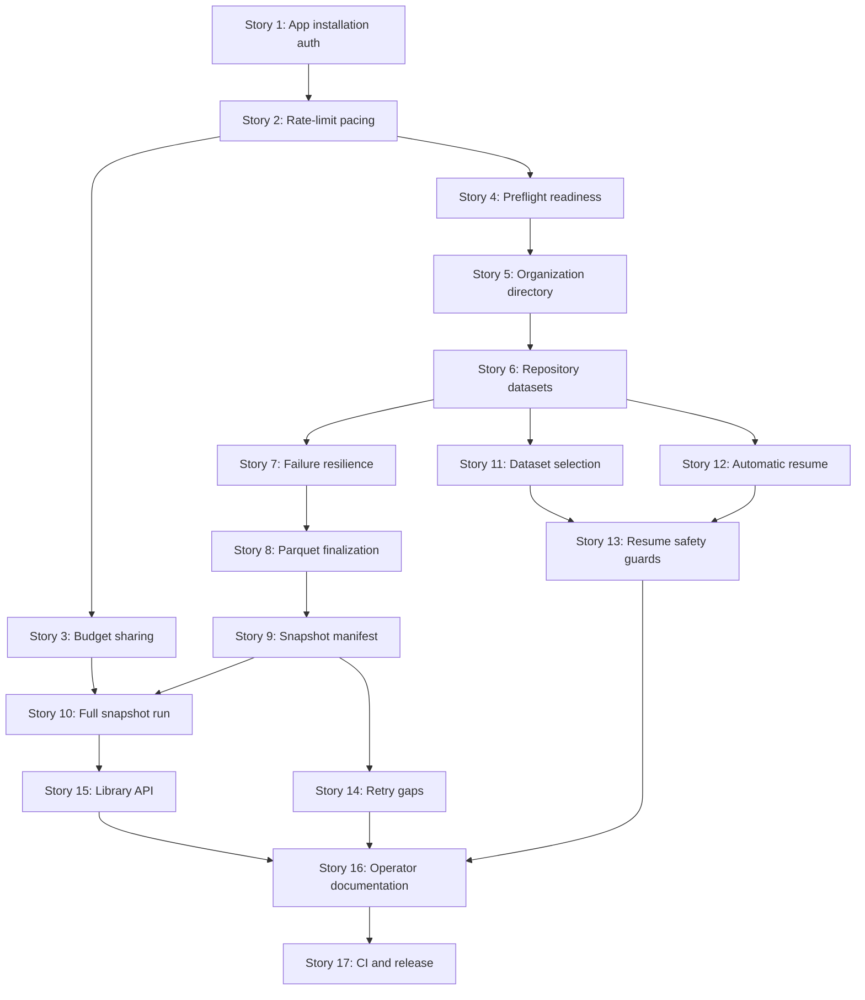

# org-harvest - Implementation Stories

**Spec:** [../spec.md](../spec.md)
**Architecture:** [../architecture.md](../architecture.md)

## Summary

17 stories deliver the spec's 11 user stories (89 acceptance criteria) as independently verifiable vertical slices. The sequence follows two threads:

- **Foundation → org fetch → repo fetch → resilience → output** (Stories 1–9): builds the shared transport, auth, pacing, preflight, and dataset-registry infrastructure, then the two-phase harvest itself (architecture.md, Decision 4), then makes the resulting snapshot trustworthy and analysis-ready.
- **Refinements on the working core** (Stories 10–17): the single-command capstone, then selection, resume, retry-gaps, the library surface, documentation, and CI/release — each layering a distinct, separately valuable capability onto Story 9's working harvest.

Two large multi-dataset stories (5 and 6) are intentionally not split further by individual dataset name: every dataset within a story shares the exact same declarative registry mechanism (architecture.md, Decision 1), so splitting by dataset would be a technical split with no independent user-facing distinction between, say, "download issues" and "download labels."

A few requirements live in the spec's Functional Requirements or Edge Cases rather than a numbered Acceptance Criterion (FR-5's systemic-failure threshold, FR-9's concurrent-run safety, FR-13's documentation deliverable). These are cited by their FR/EC identifier in the relevant story rather than an AC number.

**Note on AC-10.1–10.4:** these ("tests cover authentication, pagination, resume, rate limiting, partial failures, systemic failure, preflight, retry-gaps, output writing," "no live network calls," "assert on outgoing requests," "no real waiting in tests") are not assigned to any single story. They are satisfied incrementally — every story's own Exit Criteria requires its quality checks and tests to pass, and those tests are what AC-10.1–10.4 describe. Story 17 wires that existing coverage into CI; it does not add it.

## Story Dependencies

## Story Overview

| Story | Name | Depends On |
|-------|------|------------|
| 1 | App installation auth | - |
| 2 | Rate-limit pacing | 1 |
| 3 | Budget sharing | 2 |
| 4 | Preflight readiness | 2 |
| 5 | Organization directory | 4 |
| 6 | Repository datasets | 5 |
| 7 | Failure resilience | 6 |
| 8 | Parquet finalization | 7 |
| 9 | Snapshot manifest | 8 |
| 10 | Full snapshot run | 3, 9 |
| 11 | Dataset selection | 6 |
| 12 | Automatic resume | 6 |
| 13 | Resume safety guards | 11, 12 |
| 14 | Retry gaps | 9 |
| 15 | Library API | 10 |
| 16 | Operator documentation | 13, 14, 15 |
| 17 | CI and release | 16 |
